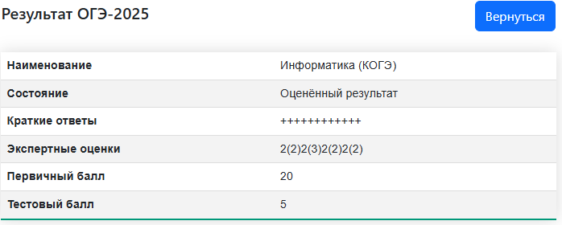

# OGE_16 #
 ## Всем привет я выпускник 9 класса, сдавал огэ по физике и иформатики. Сам сдал информатику на ***20 баллов из 21 балла*** ##

\
Я хочу поделиться своими знаниями и помочь вам с подготовкой к огэ по информатике

В этом репозитории будут шаблоны к 16 заданию огэ одно из самых **сложных** на экзамене.\
Я предоставлю вам шаблоны, которые помогут вам решить все типы 16 задания, от вас требуется только маленькое понимание программирования и кодинга.Так же порещаем несколь интересных задачек и я вам предоставлю ссылки на полезные материалы по которым сам готовился к экзамену.

Для каждого шаблона будет подробное объяснение как он работает, будут приведены примеры использования.\
Так же шаблоны будут предоставлены в виде обычного текса (как этот) и как код который вы можете править как вам угодно

Шаблоны будут написаны в основном на Питоне,но чутка позже я добавлю и Паскаль(Сам сдавал информатику на питоне).\
Будут только шаблоны для 16 задания, так как это единственное шаблонное задание из 2 части в ОГЭ.

Так же хочу вас пригласить ко мне на запись там мы изучим как устроен экзамен и я вам помогу заполнить ваши пробелы и помогу затащить огэ 2026\
[Telegram](https://t.me/emer0ld "Ссылка на связь со мной в телеграмме")\
[Vkontakte](https://m.vk.com/molniya66 "Ссылка на связь со мной в Вконтакте")

Полезные материалы:\
[Циклы for и while](https://skillbox.ru/media/code/tsikly-v-python-kak-rabotayut-i-kakie-byvayut/)\
[Уроки и практика 16 задание(Ютуб)](https://youtu.be/2caZ72RgaYk?si=_o6pCZNDPo3ELyen)\
[Информатика ОГЭ 2026 Умскул(Рутуб)](https://rutube.ru/channel/45202790/)
