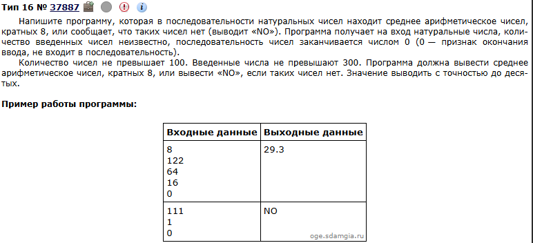

# Это подробное описание с пример как работает 1 шаблон с циклом while #
Возьмём в пример задание из Решу ОГЭ ([Тип 16 № 37887](https://inf-oge.sdamgia.ru/problem?id=37887))\
\
Тут мы будем использовать цикл while, ведь в задании указано
>последовательность чисел заканчивается числом 0 (0  — признак окончания ввода, не входит в последовательность).

### Когда вы видите такую надпись, то нужно использовать цикл while. ###

## Итак, первым делом читаем что от нас требуется ##
>Программа должна вывести среднее арифметическое чисел, кратных 8, или вывести «NO», если таких чисел нет. Значение выводить с точностью до десятых.

Задача ясна. Приступаем к написанию программы. \
Для начала нам нужно объявить все нужные нам переменные
>Переменная x будет хранить числа пользователя, но сначала мы присвоем ей значение 1

>Переменная n будет хранить кол-во чисел кратных 8 

>Переменная sum, которая будет хранить сумму чисел кратных 8

```python
n=int(0)
sum=int(0)
x=int(1)
```
Теперь напишем конструкцию цикла while которая соответсвует нашему условию.
```python
while x != 0:
    x = int(input())
    if x == 0:
        break
    if x % 8 == 0:
        sum+= x
        n += 1
```
Отлично теперь нужно написать код для проверки, что есть числа которые кратны 8
```python
if n > 0:
    num = sum/n#Эту переменную мы объявили только что, потому что в ней будет храниться среднее арифметическое чисел
    print(round(num, 1))# Функция round позволяет округлять числа до нужных знаков после запятой
else:
    print('NO')
```
### Вот и всё мы написали нашу программу, осталось только собрать код воедино и провести тесты ###
```python
n=int(0)
sum=int(0)
x=int(1)
while x != 0:
    x = int(input())
    if x == 0:
        break
    if x % 8 == 0:
        sum+= x
        n += 1
if n > 0:
    num = sum/n#Эту переменную мы объявили только что, потому что в ней будет храниться среднее арифметическое чисел
    print(round(num, 1))# Функция round позволяет округлять числа до нужных знаков после запятой
else:
    print('NO')
```

Первый тест наша программа прошла \

Второй тест наша программа тоже прошла.\
Эксперты будут копировать ваш код и прогонять через собственные тесты, если ваша программа прошла все тесты,то 2 балла у вас в кармане.
