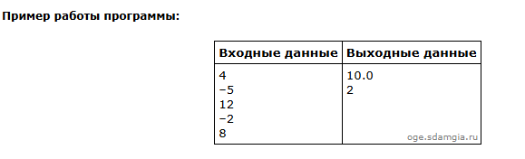

# Это подробное описание как должен работать второй шаблон с примером #
Возьмём 16 задание из Решу ОГЭ(Тип 16[ №  37692](https://inf-oge.sdamgia.ru/problem?id=37692))\


Тут мы будем использовать цикл for, ведь в условии задании написано
>Программа получает на вход количество дней/чисел


### Если вы увидите эти строки в любом задании, то смело используйте цикл for. ###


## Итак, первым делом читаем что от нас требуется ##
>Найдите среднюю температуру для дней, когда температура поднималась выше нуля градусов.

Задача ясна. Приступаем к написанию программы. \
Для начала нужно запросить у пользователя количество дней наблюдения, а так же объявить переменные
>Перемення n, которая будет хранить кол-во дней, 

>Переменная sum, которая будет хранить сумму температур дней, в которых она поднималась больше 0 градусов

>Переменная quantity, которая будет хранить количество дней в которых температура была выше 0 градусов

```python
n = int(input())
sum =int(0)
quantity =int(0)
```
Дальше нам нужно написать конструкцию цикла for, которая будет удовлетворять нашим условиям:
```python
for i in range(n):
    x=int(input())#В этой переменной будет храниться градусная мера 
    if x>0:
        quantity+=1
        sum+=x
print(sum/quantity)
print(quantity)
```
Вот и всё мы решили задачу, осталось только собрать код воедино и запустить его
```python
n = int(input())
sum =int(0)
quantity =int(0)
for i in range(n):
    x=int(input())#В этой переменной будет храниться градусная мера 
    if x>0:
        quantity+=1
        sum+=x
print(sum/quantity)
print(quantity)
```
\
Как мы видим наши ответы сошлись, если мы посмотрим на пример программы который нам предоставили, то мы можем быть уверены, что программа написана правильно   \
На экзамене у вас может быть два теста,что конечно лучше чем один.Эксперты будут копировать ваш код и прогонять через собственные тесты, если ваша программа прошла все тесты,то 2 балла у вас в кармане.
